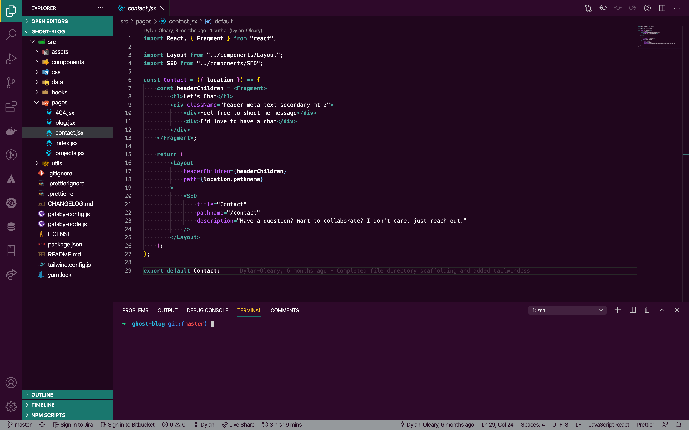

# Mighty Ducks Theme (VS Code)

A VS Code theme inspired by the greatest jerseys of all time

## Preview  

## How To Install
+ Open **Extensions** in Visual Studio Code. *(View → Extensions)*
+ Search for `Mighty Ducks`
+ **Install** it and **Reload** your editor!
+ Select it by going to Code → Preferences → Color Theme → ***Mighty Ducks***

## Enjoy :ice_hockey:
